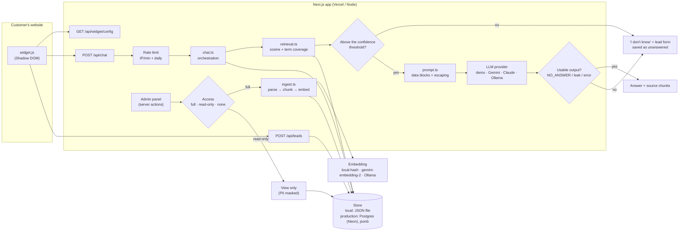

# AI Support Assistant

**English** · [Türkçe](README.tr.md)

**Live demo:** [ai-support-assistant-beta.vercel.app](https://ai-support-assistant-beta.vercel.app) (demo mode: no AI key, read-only panel, `/try` switched off) · Source: [github.com/alkanefe22/ai-support-assistant](https://github.com/alkanefe22/ai-support-assistant)

A support assistant that builds a knowledge base from a business's documents, is added to its website with a
**single script tag**, and answers **only from that knowledge base, citing its source**. When the answer isn't there it
doesn't make one up: it says "I don't have information on that, let me put you in touch with the team", collects the
visitor's contact details with their consent and saves them as a **lead** for the business.


## Status

| Area | Status |
|---|---|
| Demo mode (no API key, free) | ✅ Works end to end: 367 automated tests, plus manual checks in the browser |
| "Try it with your own site" (`/try`) | ✅ **Tested on real sites (2026-09-25, Ollama `qwen3.5:9b` + `bge-m3`):** Basecamp (EN SaaS), DentalPark (dental clinic), Mado (restaurant chain) and Kahve Dünyası (e-commerce) each became an assistant in 7–19 s. Questions about address, phone, membership, trial period and billing were answered with sources; off-topic questions, and information the site only shows as a teaser ("click to read more"), were handed off to the team. Content loaded by JavaScript (e.g. Basecamp's plan prices) can't be read. |
| Public read-only demo (`PUBLIC_DEMO=true`) | ✅ Enforced on the server, tested |
| Refuses to start in production with missing or weak admin credentials | ✅ Tested, verified with `next start` |
| Admin login attempt limit (5 per 5 min per IP) | ✅ Tested |
| Live mode, Gemini | 🟡 **Partly verified:** the model list, `gemini-3.5-flash` and `gemini-embedding-2` worked with real calls, and the embedding threshold was calibrated on real data. **An end-to-end live chat test is still pending** (the provider returned 503/429 on the first attempt). |
| Live mode, Claude | ⚪ Code ready, never tried |
| Local model, Ollama | ✅ **Verified end to end (2026-09-25):** `qwen3.5:9b` + `bge-m3`, 5 businesses, 289 questions × 3 runs: 867/867. See [Evaluation](#evaluation). |
| Persistent database (Postgres / Neon) | ✅ Via `DATABASE_URL`; the same contract tests as the JSON store pass on real Postgres (PGlite) |
| Production SaaS (multi-tenant, billing) | ⚪ Out of scope, see [docs/internal/NEXT_STEPS.md](docs/internal/NEXT_STEPS.md) (Turkish) |

## Features

- **Knowledge base:** upload PDF, TXT or Markdown, or paste FAQ text → structure-aware chunking → embedding → hybrid search.
- **Sourced answers:** under every answer, a collapsible box shows which document and section it came from.
- **No invention:** questions below the confidence threshold never reach the LLM, and the model must return
  `[[NO_ANSWER]]` when the context doesn't contain the answer. Every answer must name the chunk it used with
  `[[SOURCE:n]]`, so the source shown is the chunk the model actually used, not a guess. Answers without a source, and
  refusals written as prose ("no information is available"), are handed off.
- **Lead capture:** when a question can't be answered, a contact form with a consent checkbox (KVKK/GDPR) opens in the widget.
- **Natural small talk:** Turkish shorthand like "slm", "mrb", "tşk", "tamam", "?" and typos ("merhaa") are recognised without an API call and don't open the
  lead form. In live mode, chat messages that don't match the rules are answered by the model; questions asking for
  information are still answered only from the knowledge base, and a small-talk reply containing numbers, emails or links is rejected.
- **Admin panel:** upload/delete/re-index the knowledge base; assistant name, colour and welcome message (TR/EN);
  allowed domains; conversation history; unanswered questions (most asked first); leads + CSV export; multiple assistants.
- **Try it with your own site (`/try`):** a business owner enters their site's address (or pastes FAQ text / uploads a
  file); the system reads the site's FAQ, pricing, contact and similar pages and builds a temporary assistant with the
  site's own name and colour in about a minute. The "I want this on my site" form lands as a sales lead on the panel's
  **Trials** page. Trials delete themselves after 24 hours (7 days for interested owners). It can be switched off with `TRY_ENABLED=false`.
- **Public read-only demo:** visitors can browse the panel without a password; uploading, deleting and changing
  settings are disabled, and visitors' contact details are masked.
- **Widget:** one `<script>`, no dependencies, **10.6 KB (~4.3 KB gzipped)**, Shadow DOM so it never breaks the host
  site's styles, full screen on mobile, keyboard accessible, all text rendered with `textContent` (no XSS).
- **Demo site:** a fictional dental clinic, "Gülümse Diş Kliniği", with TR and EN knowledge bases ready.
- **Cost control:** demo mode costs nothing. In live mode: a per-minute limit per IP, a daily limit per assistant,
  question length, a context token budget and an output token cap; failed calls aren't retried.
- **Prompt injection defence:** knowledge base text is treated as data, not instructions; delimiters are escaped,
  suspicious content is flagged, and model output that leaks instructions is rejected. All tested.

## Screenshots

The product UI is in Turkish; the widget and demo site also run in English.

| No information → handoff + lead form | Mobile (EN) |
|---|---|
|  |  |

| Panel: overview | Panel: knowledge base |
|---|---|
|  |  |

| Panel: unanswered questions | Panel: conversation history |
|---|---|
|  |  |

| Public demo: read-only knowledge base | Public demo: masked leads |
|---|---|
|  |  |

More: [landing](docs/screenshots/01-landing.png) · [leads (owner view)](docs/screenshots/10-admin-leads.png) · [settings](docs/screenshots/11-admin-settings.png) · [mobile demo page](docs/screenshots/04-mobile-demo-en.png)

## Architecture



**Chat flow:**

1. The widget loads its settings using `data-assistant` from the script tag and sends the visitor's question to `/api/chat`.
2. The per-minute rate limit per IP (keyed by an HMAC hash of the IP) and the daily limit per assistant are checked.
3. The question is searched among the chunks in the visitor's language. The score is a weighted sum of cosine
   similarity and IDF-weighted term coverage, with weights per model (`local`: 0.5 / 0.5 · `gemini-embedding-2`: 0.95 / 0.05).
4. **Below the threshold, the LLM is never called** → "I don't know" + lead form, and the question is saved to
   "unanswered". (No cost either.)
5. Above the threshold, the best chunks are wrapped in `<kb_document>` data blocks until the context token budget is
   full, and the model is called.
6. If the model returns `[[NO_ANSWER]]` or its output leaks the system instructions, the visitor is handed off. If the
   provider fails (timeout, 503, quota), the visitor is told "I can't answer right now" and still offered the contact form.

## Quick start

Requires Node.js 20+ (tested with 22).

```bash
npm install
```

```bash
npm run dev
```

- Landing: http://localhost:3000
- Demo site (TR): http://localhost:3000/demo · (EN): http://localhost:3000/demo?lang=en
- Admin panel: http://localhost:3000/admin

If `data/db.json` doesn't exist on first start, the demo assistant and knowledge base are loaded **automatically**. To reset:

```bash
npm run seed
```

To try the public read-only demo locally (forces the demo provider regardless of `.env.local`, free):

```bash
npm run build
```

```bash
npm run start:public-demo
```

`next start` runs in production mode, so `.env.local` must define `ADMIN_PASSWORD` (at least 12 characters) and
`SESSION_SECRET` (at least 32 characters, not the example value); otherwise the server refuses to start and lists what's missing.

To open the same demo with the **real AI** configured in `.env.local` (Gemini / Claude / Ollama). In this mode the
limits in `.env.local` apply; `/try` visitors click the suggested questions in quick succession, so keep
`RATE_LIMIT_PER_MINUTE` above 5:

```bash
npm run start:public-demo -- --live
```

"Try it with your own site" page: http://localhost:3000/try

### Quality checks

```bash
npm test
```

```bash
npm run typecheck
```

```bash
npm run lint
```

```bash
npm run build
```

To regenerate the README screenshots (against a running server, with the system's installed Chrome; no browser
download). If the server runs with `start:public-demo`, read-only screenshots are taken too; if `.env.local` has
`ADMIN_PASSWORD`, it logs in automatically for the full-access panel shots:

```bash
BASE_URL=http://localhost:3000 npm run screenshots
```

## Environment variables

Copy `.env.example` to `.env.local`.

| Variable | Default | Description |
|---|---|---|
| `AI_PROVIDER` | `demo` | `demo`, `gemini`, `claude` or `ollama`. Without a Gemini/Claude key it **falls back to demo mode**; `ollama` needs no key. |
| `GEMINI_API_KEY` / `GEMINI_MODEL` | — / `gemini-3.5-flash` | Generation with Gemini (and optionally embeddings). |
| `GEMINI_EMBEDDING_MODEL` | `gemini-embedding-2` | Embedding model used when `EMBEDDING_PROVIDER=gemini`. |
| `ANTHROPIC_API_KEY` / `CLAUDE_MODEL` | — / `claude-haiku-4-5` | Generation with Claude. |
| `EMBEDDING_PROVIDER` | `local` | `local` (free, offline) or `gemini` (`GEMINI_EMBEDDING_MODEL`). Claude has no embedding API, so Claude mode uses `local`. After changing it, click **Re-index** in the panel. Seeding and the automatic first-start setup use the selected provider and fall back to `local` if it's unreachable. |
| `OLLAMA_URL` / `OLLAMA_MODEL` | `http://localhost:11434` / `gemma3:12b` | Local Ollama server and answer model. |
| `OLLAMA_EMBEDDING_MODEL` | `bge-m3` | Local (multilingual) embedding model used when `EMBEDDING_PROVIDER=ollama`. |
| `OLLAMA_TIMEOUT_MS` | `120000` | A local model can be slow on first load. |
| `OLLAMA_THINK` | — | For reasoning models (qwen3.x etc.) set `false` so the thinking phase doesn't eat the answer budget. Not sent when empty. |
| `RETRIEVAL_WEIGHT_COS` / `RETRIEVAL_MIN_SCORE` / `RETRIEVAL_MIN_COVERAGE` | — | "I don't know" threshold for semantic embeddings. Empty uses the `gemini-embedding-2` calibration; for another model paste the output of `npm run calibrate`. |
| `PUBLIC_DEMO` | — | `true` opens the panel **read-only** to everyone (see below). |
| `RATE_LIMIT_PER_MINUTE` | `8` | Questions per minute per IP + assistant. |
| `DAILY_REQUEST_LIMIT` | `300` | Total questions per assistant per day. |
| `MAX_QUESTION_CHARS` | `500` | Maximum question length. |
| `MAX_CONTEXT_TOKENS` | `1500` | Token budget for the knowledge base context sent to the model (approximate, 4 characters ≈ 1 token). |
| `MAX_OUTPUT_TOKENS` | `350` | Output token cap per answer. |
| `ADMIN_PASSWORD` | — | Panel password. **Required in production, at least 12 characters**; otherwise the server won't start. Can be left empty only with `npm run dev` in demo mode (panel open, warning banner shown). |
| `SESSION_SECRET` | — | Cookie signature and IP hash key. **Required in production, at least 32 characters**, and not the example value from `.env.example` (`openssl rand -hex 32`); otherwise the server won't start. |
| `DATABASE_URL` | — | Postgres connection (Neon). When set, all data is kept in Postgres; tables are created on first start and the demo data is loaded once. When empty, a local JSON file is used. |
| `DATA_DIR` | `data` | Local JSON database folder (without `DATABASE_URL`; automatically `/tmp` on Vercel). |
| `TRY_ENABLED` | `true` | `false` switches `/try` off: the API returns `503`, the page points to the demo site and the landing page hides its button. The public demo is deployed this way (no requests to outside sites). |
| `TRY_MAX_PAGES` / `TRY_MAX_CHARS` | `8` / `60000` | Maximum pages read and text length per trial. |
| `TRY_TTL_HOURS` | `24` | Lifetime of a trial assistant (7 days once the owner says "I want this on my site"). |
| `TRY_PER_IP_PER_HOUR` / `TRY_DAILY_LIMIT` | `3` / `30` | Trial creation limits (every trial makes embedding calls). |
| `TRY_ALLOW_PRIVATE` | — | **Local testing only:** `1` allows localhost / private IPs / non-standard ports. Never enable in production. |

### Modes

- **Demo mode** (default, no key): search runs for real; instead of generating text, the answer is extracted from the
  most relevant chunk, and greetings/thanks use prepared replies. No external API is called.
- **Live mode:** `AI_PROVIDER=gemini` + `GEMINI_API_KEY`, or `AI_PROVIDER=claude` + `ANTHROPIC_API_KEY`. Calls are
  made without an SDK, directly with `fetch` (`src/lib/llm/`), temperature 0.1, 20 s timeout, no retries.
- **Local model (Ollama):** `AI_PROVIDER=ollama` (optionally with `EMBEDDING_PROVIDER=ollama`). The model runs on this
  machine: no key, no quota, no cost, and no data leaves it. Ideal for repeating live tests without limits. Setup:
  `ollama pull gemma3:12b` and `ollama pull bge-m3`, then `npm run calibrate` and `npm run live-check`.
- **Public read-only demo** (`PUBLIC_DEMO=true`): in the version published for a portfolio, visitors browse the panel
  without a password. In production (`next start`, Vercel) `ADMIN_PASSWORD` and `SESSION_SECRET` are still required:
  the owner logs in with that password, and the server won't start with missing or weak values. The
  "no `ADMIN_PASSWORD`" column below applies only to `npm run dev`.

  | Visitor | No `ADMIN_PASSWORD` | `ADMIN_PASSWORD` set |
  |---|---|---|
  | Not logged in | read-only | read-only ("Admin login" link shown) |
  | Logged-in owner | — | full access |

  In read-only mode every server action that changes data (upload, add FAQ, delete, re-index, settings, new
  assistant, mark unanswered, delete lead) is **rejected on the server**; the disabled buttons in the UI are only
  informative. Lead CSV export returns `403`. Names, emails and phone numbers are masked in leads, conversation
  history and unanswered questions. The widget and demo site keep working normally.

## Live mode status and calibration (Gemini)

**Honest summary:** **partly verified** with Gemini. Request formats, model names and the embedding threshold were
verified with real calls, but an **end-to-end live test** showing the model's real answers, and that it follows the
`[[NO_ANSWER]]` rule for questions outside the knowledge base, **hasn't completed successfully yet**.

| Verified (2026-09-24) | Result |
|---|---|
| Model list (`GET /v1beta/models`) | ✅ 44 generation + 3 embedding models |
| Chat: `gemini-3.5-flash` with the app's request body | ✅ 200, `thinkingBudget: 0` accepted |
| Embedding: `gemini-embedding-2` (768 dimensions) | ✅ 200 |
| "I don't know" threshold calibration (37 questions) | ✅ table below |
| End-to-end live chat (`npm run live-check`, 8 questions) | ⏳ **Pending**: on the first attempt all 8 calls returned 503 / timeout / 429; not retried |

The threshold for `gemini-embedding-2` was calibrated on the demo knowledge base (`npm run calibrate`). To save quota
each text is embedded **once**, in 3 batch calls in total; results are written to `data/tmp/calibration.json`, and the
threshold search can be repeated without touching the API with `npm run calibrate -- --offline`.

| Question group | Example | Result (threshold: `0.95 × cosine + 0.05 × coverage ≥ 0.618`) |
|---|---|---|
| In domain (15) | "Are you open on Sunday?" | 15/15 correct section, above threshold |
| Synonyms (10) | "My mouth smells bad" → *Halitosis*, "braces" → *Orthodontics*, "bad breath" → *halitosis* | 10/10 correct section, above threshold (including ones with zero word overlap) |
| Off topic (8) | weather, exchange rates, laptops, eye exams, jailbreak | 8/8 below threshold |
| Dental but not in the knowledge base (4) | root canal, wisdom teeth, veneers | **above threshold**: the model's `[[NO_ANSWER]]` rule must filter these (to be verified in the live test) |

The safety margin is about 0.026 in both directions; re-run the calibration as the knowledge base grows. The `local`
embedding can't catch synonyms ("bad breath" ↔ "halitosis"), so Gemini embeddings are recommended for live use.

`npm run live-check` runs 8 questions through the app's own `handleChat` flow (each question once, 15 s between calls,
on a temporary database). A provider error is never counted as a pass.

## Try it with your own site (`/try`)

Sales flow: the business owner enters their site's address on `/try` → once the assistant is ready a preview page
opens (with the site's name and `theme-color`, the widget open, "ask these" buttons generated from questions in the
knowledge base, and one question that isn't in it, to show that it doesn't invent) → "Let's add this to your site"
form → **Trials** in the panel.

| Topic | Implementation |
|---|---|
| Which pages are read | The home page plus links, with FAQ / pricing / services / contact / about first; cart, login, file and old blog pages are skipped; at most `TRY_MAX_PAGES` pages, same domain only. |
| SSRF | http/https only, ports 80/443, no usernames in the URL; the host name is resolved and private / local / link-local / CGNAT / IPv6 ULA addresses are rejected **on every redirect**. 1.5 MB and 8 s per response, HTML only. |
| Content safety | The text read goes through the normal knowledge base path: injection flagging, data blocks and required sources all apply. |
| Abuse | A "this is my site" checkbox is required; hourly limit per IP and a daily total; trials are deleted after 24 hours (with their conversations, leads and chunks). |
| Privacy | Trial assistants don't appear in the panel's assistant list; in the read-only demo, contact details on the Trials page are masked. |
| Cleanup | Banners repeated on every page (promotions, phone, footer) are kept only on the home page; different spellings of the same page and other language versions (`/en`, `?lang=`) are read once / not at all; cookie, privacy and careers pages go last. The business name is taken from `og:site_name` → the common part of page titles → the home page title, in that order. |
| Known limit | Sites that load content with JavaScript (SPAs) may yield little text; the user is then asked to paste FAQ text. |

## Installing the widget

```html
<script src="https://YOUR-DOMAIN/widget.js" data-assistant="gulumse-dis" async></script>
```

| Attribute | Values |
|---|---|
| `data-assistant` | Assistant ID shown in the panel (required) |
| `data-lang` | `tr` / `en` (defaults to the page's `lang` attribute) |
| `data-position` | `right` (default) / `left` |
| `data-open` | `true` opens the panel when the page loads |

JavaScript API: `window.AISupportAssistant.open()`, `.close()`, `.setLang("en")`.

If **Allowed sites** is filled in the panel, the widget endpoints only accept requests from those origins.

## Retrieval and "I don't know" behaviour

- **Chunking:** Markdown headings and FAQ patterns (`## Question?`, `Q: … A:`, a short line ending in `?`) count as
  section boundaries; sections are packed into ~700 characters, and when a section is split its last sentence carries
  over to the next chunk.
- **Turkish:** Turkish lowercase rules + accent folding (`diş` = `dis`), first-5-character stemming, prefix matching for
  suffix variants (`gün`/`günleri`, `kapanıyor`/`kapalı`) and a small synonym list (`fiyat/ücret/price`, `çocuk/kids` …).
- **Score:** in `local` mode, the average of the cosine of hashed stem + character trigram vectors and IDF-weighted
  query term coverage. Terms that never appear in the knowledge base get the highest weight, so off-topic questions
  that share a single word (e.g. "Do you do eye exams?") can't pass the threshold.
- **Hybrid search:** if the semantic model (Gemini / Ollama) misses the threshold, typo-tolerant word matching with its
  own thresholds gets a second chance ("cocuklara bakiyonuz mu", a misspelled "do you see children" → *Çocuklara hizmet veriyor musunuz?*). Irrelevant questions are still
  filtered and the model's answer must still cite a source. Badly misspelled words can't be caught; the assistant then
  hands off instead of inventing.
- **Thresholds** (`src/lib/rag/retrieval.ts`) are separate per embedding model: tuned for `local` with the 22 in-domain
  + 11 off-domain questions in `tests/retrieval.test.ts`, and for `gemini-embedding-2` with the calibration above.

## Prompt injection defence

| Layer | Where | Test |
|---|---|---|
| Knowledge base text only in the user turn, inside `<kb_document>` data blocks; the system prompt says these are untrusted **data** and instructions inside them must not be followed | `src/lib/prompt.ts` | `injection.test.ts` |
| `<`, `>`, `[[`, `]]` are escaped: a document can't close its own block and open a fake `<system>` block; the visitor's question is escaped too | `escapeForDataBlock` | "escapes delimiter look-alikes…" |
| Instruction-like content is flagged at upload time and a warning is shown in the panel | `looksLikeInjection`, `ingest.ts` | "marks suspicious chunks at ingest…" |
| The demo responder never repeats instruction-like sentences | `llm/demo.ts` | "demo responder answers from a poisoned document…" |
| A visitor's jailbreak attempt doesn't match the knowledge base, so it never reaches the model (also below threshold with Gemini embeddings) | confidence threshold | "a visitor's jailbreak attempt never reaches the model…" |
| Model output that leaks system instructions/delimiters is rejected and the visitor handed off | `isUsableAnswer` | "drops a model reply that leaks the system prompt" |

> Note: no defence is 100%. The tests verify the prompt structure, escaping and output filter with a mock model; that
> the live model follows these rules hasn't yet been verified with an end-to-end live test (see "Live mode status").

## Evaluation

`npm run eval` sets up the knowledge bases of five different businesses and runs 289 questions through the app's own
flow. Every answer is checked automatically: expected outcome (answer / small talk / handoff), correct section, answer
language, phrases that must / must not appear, and an **invented-number check** (every number in the answer must
appear in the cited section or in the question). Report: `data/tmp/eval-report.md`. It won't run against paid
providers without `EVAL_ALLOW_PAID=1`; `EVAL_REPEAT=3` catches flaky cases, `EVAL_BIZ=taskflow` runs a single business.

| Business (fictional) | Knowledge base format | Questions |
|---|---|---|
| Gülümse Diş Kliniği (dental clinic) | Markdown FAQ, TR + EN | 144 |
| Berrak Su Arıtma (water filters) | Markdown FAQ + plain-text warranty terms | 37 |
| Moda Sepeti (online clothing) | Plain-text "Q: / A:" + long returns policy with ALL-CAPS headings | 36 |
| Lezzet Durağı (restaurant) | Bulleted menu and price list | 35 |
| TaskFlow (software) | English-only help centre; includes visitors asking in Turkish | 37 |

Question types: basics, synonyms and symptoms ("my breath smells", "I don't eat meat", "can I get my money back?"),
typos and slang, topics close to the business but not in the knowledge base (root canal, tailoring, lahmacun, Gantt
view), another business's question (a dental question to the clothing store), off topic, small talk, attacks,
follow-ups and follow-up traps ("Root canal?" → "What does it cost?": the implant price must not be given).

**Latest result (2026-09-25, `qwen3.5:9b` + `bge-m3`, each question 3 times): 867/867 (100%).** Zero invented
numbers, wrong languages or followed attacks. The "I don't know" threshold was computed **automatically** for each
business (0.44 – 0.47), with no manual tuning.

Re-run after the changes that followed the real-site `/try` tours (address/phone tags, new refusal patterns, a
"pass numbers on with their qualifier" rule) (2026-09-26, each question once): **289/289**. One case was updated: when
asked for the recipe of a dish that's on the menu, "we can't share recipes, it's 295 TL on our menu" is now accepted;
an answer with recipe steps still fails.

The AI-free demo mode scores 78% on the same set: without semantic search or follow-up resolution, most synonyms and
follow-up questions are handed off. Invented numbers are zero in demo mode too.

**Known limits:** very short follow-ups that refer back to the previous topic ("Is shipping paid?") are sometimes read
in a general sense without a "so". Both readings are accepted and the information given is correct. The test set is
made of fictional businesses; measuring with a real business's documents is recommended.

### Automatic "I don't know" threshold

Every knowledge base produces different scores, so a single global threshold doesn't fit every business. When a
document is added, deleted or re-indexed (`src/lib/rag/autocalibrate.ts`):
1. The business's knowledge base is asked 24 questions no support site should answer (weather, exchange rates,
   football, homework, stocks, …; TR and EN separately).
2. The 90th percentile of their scores + 0.03 is saved as the business's threshold.
3. "Near-topic" questions that pass the threshold (root canal, tailoring) are filtered by the model's own rule: an
   answer that can't cite a source isn't shown.

Cost: one batch embedding call per language when documents change. The `RETRIEVAL_*` values in env are only a fallback
for businesses without a calibration.

**The fixes that led to this result** (each from an error seen in real model output): questions no longer brushed off
as small talk; a required source tag; catching refusals written as prose ("no information is available", "the
document … does not specify"); not saying "no" for things absent from the knowledge base either; hybrid search (typos);
rewriting and re-searching requests that weren't found; turning short follow-ups into full questions before
answering; giving the model 6 candidate sections instead of 4; recognising ALL-CAPS and "…:" headings in plain-text
documents; a per-business automatic threshold; handing off topics the knowledge base knows nothing about in demo mode.

## Tests

`npm test`: 367 tests (Vitest), all without network access:

- `retrieval.test.ts`: 22 in-domain questions find the right section, 11 off-domain questions can't pass the threshold, language preference, empty knowledge base.
- `chat.test.ts`: sourced answers, EN answers, "I don't know" + unanswered record, greetings, conversation history, length limit, model `NO_ANSWER`/error cases, context budget.
- `injection.test.ts`: detection, escaping, data block structure, poisoned document, jailbreak, leak filter.
- `readonly.test.ts`: the access matrix; in the public demo the real server actions (with Next.js `cookies`/`redirect` mocked) change no data, CSV returns `403`, and the owner logs in and gets full access; email/phone/name masking.
- `parse.test.ts`: extracting text from a real PDF generated in the test and making it answerable.
- `autocalibrate.test.ts`: per-business automatic threshold (percentile + bounds, per-language computation, disabled in local mode, uploads unaffected by provider errors, threshold applied only to the model it belongs to), resolving short follow-ups before answering.
- `triage.test.ts`: the second-chance step (rewrite + re-search, adding the original meaning to the answer prompt, never asking the same question twice, skipped on attacks and provider errors), follow-up questions, demo mode's cautious rules, new refusal patterns.
- `hybrid.test.ts`: word matching rescuing misspelled questions when semantic search misses, irrelevant questions still filtered.
- `answer.test.ts`: the required source tag (source shown = chunk used, sourceless answers rejected, the knowledge base can't fake the tag), catching prose "no information" answers (with real model outputs) and not rejecting normal answers by mistake.
- `smalltalk.test.ts`: greetings/thanks/acknowledgements and typos, real questions not mistaken for greetings, rules for live-mode small-talk replies (invented numbers/emails/links rejected).
- `ollama.test.ts`: Ollama chat and embedding request shape, hiding `<think>` blocks, thresholds set via env, the end-to-end flow (with `fetch` mocked).
- `i18n.test.ts`: TR/EN assistant and business names: fallback, the widget config endpoint, the system prompt for an English visitor.
- `try.test.ts`: `/try`: page reading (title, colour, language, stripping navigation/cookie banners), link priority, **SSRF** (private IPs, localhost, the metadata address, ports, usernames, redirects to private IPs), an end-to-end trial assistant from a fake site + a sourced answer, everything deleted on expiry, consent and IP limit on the API route, `TRY_ENABLED=false`, the "I want this on my site" lead, trial assistants not listed in the panel.
- `pgstore.test.ts`: the same store contract on both JSON and Postgres (PGlite, real Postgres in-process): ordering, cascading deletes, the daily counter, chunk cache invalidation, two server instances seeing the same database, only one cold start loading the demo data, quotes/Turkish/injection-like text stored intact, the full chat flow.
- `units.test.ts`: chunker, Turkish normalisation, embeddings, rate limiter.
- `env-check.test.ts` and `login-limit.test.ts`: the production start-up check and the admin login limit.

## Deployment and production notes

The public demo runs on Vercel with: `PUBLIC_DEMO=true`, `AI_PROVIDER=demo` (no LLM key), `TRY_ENABLED=false`,
`DATABASE_URL` (Neon) and the production-required `ADMIN_PASSWORD` / `SESSION_SECRET`. Without `DATABASE_URL`, the
local JSON database is written to `/tmp` on Vercel and is **temporary** (recreated with the demo data on every cold start).

| Component | This repo | At scale |
|---|---|---|
| Database | **Postgres** (`PgStore`, Neon HTTP driver) when `DATABASE_URL` is set, otherwise `JsonStore` (single file). Records are stored as `jsonb`; embeddings also live in each chunk's `jsonb` record and similarity is computed **in the app** (chunks are cached per server instance). pgvector is not used. | For large knowledge bases, move embeddings to a **pgvector** column and let the database search with `ORDER BY embedding <=> $1`. The `Store` interface (`src/lib/store/types.ts`) is the single point of change. |
| Rate limit | In-memory sliding window (per instance) | **Upstash Redis** (`@upstash/ratelimit`), shared across instances. |
| Embedding | `local-hash-v1` | `gemini-embedding-2` (semantic; clearly better for synonyms and different wordings) |
| Admin auth | Single password + HMAC cookie | For a multi-user SaaS, Clerk / Auth.js + per-business permissions |
| File size | Server action 5 MB, document 4 MB | For large PDFs, upload to Blob + background processing |

The `x-forwarded-for` header is trustworthy behind a proxy like Vercel; on a Node server exposed directly to the
internet it can be spoofed, so take the rate limit key from a trusted proxy header.

## Privacy

- **Data collected:** visitors' questions and the assistant's answers (conversation history), unanswered questions, and
  name + email/phone (lead) only when the visitor **ticks the explicit consent box**. The lead endpoint doesn't save
  anything without consent.
- **IP addresses are not stored.** For rate limiting, only an HMAC hash keyed with `SESSION_SECRET` is kept in memory.
- **Admin login** is limited to 5 attempts per 5 minutes per IP (`src/lib/ratelimit.ts`); once the limit is reached even
  the correct password is rejected. The counter is per server instance; move it to a shared store for multi-instance setups.
- **Production start-up check** (`src/instrumentation-node.ts`, `src/lib/env-check.ts`): the server won't start with a
  missing or weak `ADMIN_PASSWORD` / `SESSION_SECRET`. The `dev-only-insecure-secret` fallback in the code is only
  usable in development.
- **No cookies:** the widget uses no cookies; the conversation ID is kept in `sessionStorage`, which is cleared when the tab closes.
- **Public demo:** names, emails and phone numbers are masked in the read-only panel, and CSV export is disabled. The
  demo site is fictional; visitors shouldn't enter real personal information.
- **Third parties:** in live mode the question and the relevant knowledge base chunks are sent to the selected LLM
  provider (Google Gemini or Anthropic). Lead details are **never sent to any provider.** In demo mode no data leaves the server.
- **Retention:** the store keeps the last 2000 conversations; leads can be deleted from the panel and exported as CSV
  (cells are neutralised against CSV formula injection).
- **The business's responsibility:** under KVKK/GDPR, publishing a privacy notice, setting a retention period and
  signing data processing agreements with providers are up to the business using the widget. It's advisable to keep
  sensitive (e.g. health) information out of the knowledge base and to warn visitors not to type personal health
  information into the chat.

## Project structure

```
data/seed/            Demo knowledge base (TR/EN markdown)
docs/screenshots/     README images
docs/internal/        Development notes (Turkish)
scripts/              seed, screenshots, calibrate, live-check, eval, serve-public-demo
src/app/              Landing, /demo, /try, /admin (panel + server actions), /api (chat, leads, try, widget/config)
src/lib/auth.ts       Access decision (full / read-only / none) and session
src/lib/privacy.ts    PII masking for the public demo
src/lib/rag/          text (TR normalisation), chunker, embeddings, retrieval, parse, ingest, autocalibrate
src/lib/llm/          demo, gemini, claude, ollama
src/lib/prompt.ts     System prompt + injection defence
src/lib/chat.ts       Chat orchestration
src/lib/store/        Store interface + JSON and Postgres implementations
src/lib/try/          "Try it with your own site": site reading (SSRF-protected) + temporary assistant
widget/widget.ts      Embeddable widget (esbuild → public/widget.js)
tests/                Vitest tests
```

Development notes (Turkish): [NEXT_STEPS.md](docs/internal/NEXT_STEPS.md) · [PLAN.md](docs/internal/PLAN.md) · [REPORT.md](docs/internal/REPORT.md)

## License

Portfolio project. The demo business ("Gülümse Diş Kliniği"), its address and prices are entirely fictional.
