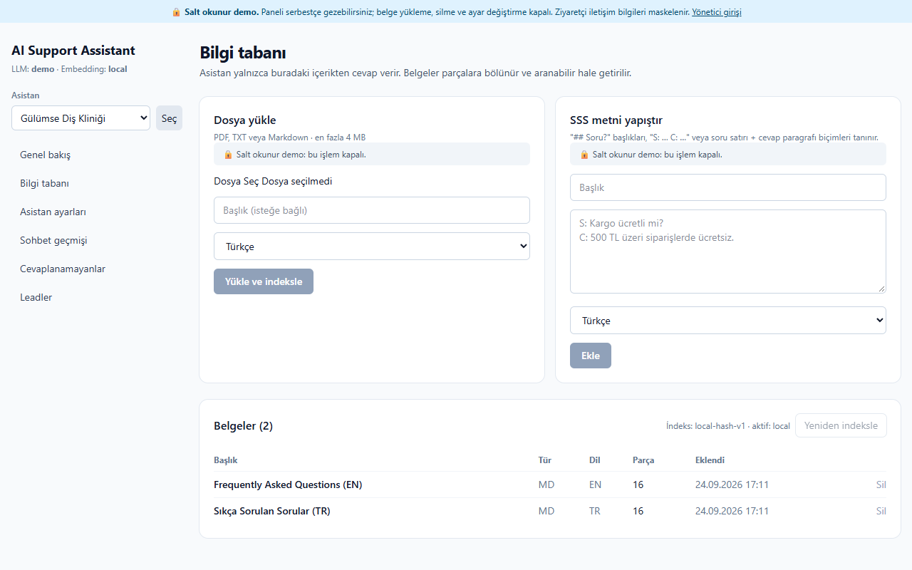
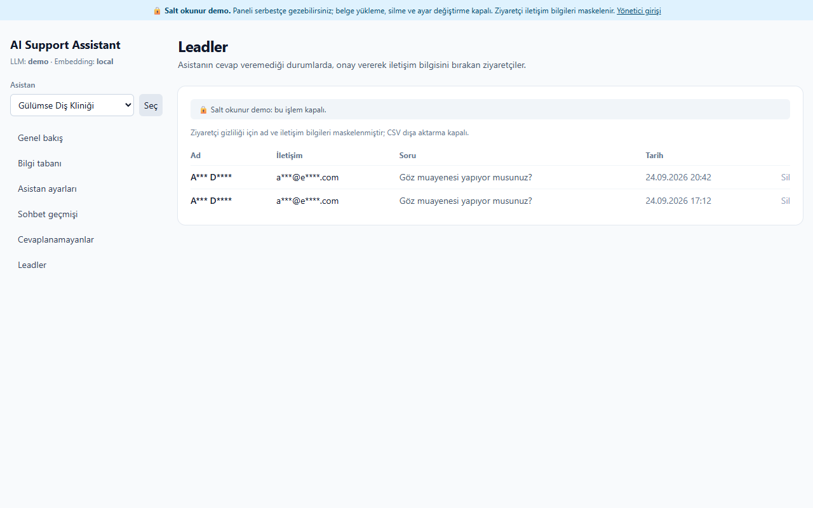
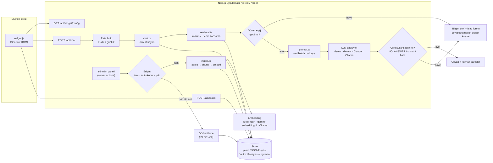

# AI Support Assistant

> **EN:** Upload your documents (PDF / TXT / Markdown / FAQ text), paste one `<script>` tag into your site, and get a
> support chat that answers **only from your knowledge base**, cites the source chunk for every answer, says
> "I don't know" instead of inventing, and turns unanswered questions into leads. Next.js + TypeScript, runs free in
> demo mode, Gemini or Claude in live mode.

**Live demo:** _yakında — Vercel'e deploy edildiğinde bağlantı buraya eklenecek_ · Kaynak: [github.com/alkanefe22/ai-support-assistant](https://github.com/alkanefe22/ai-support-assistant)

İşletmenin dokümanlarından bilgi tabanı oluşturan, sitesine **tek satırlık script** ile eklenen ve yalnızca bilgi
tabanındaki içerikten, **kaynak göstererek** cevap veren destek asistanı. Bilgi yoksa uydurmaz: "bu konuda bilgim yok,
sizi yetkiliye yönlendireyim" der, ziyaretçinin onayıyla iletişim bilgisini alır ve işletmeye **lead** olarak kaydeder.


## Durum

| Alan | Durum |
|---|---|
| Demo modu (API anahtarsız, ücretsiz) | ✅ Uçtan uca çalışıyor, 324 otomatik test + tarayıcıda elle doğrulandı |
| "Kendi sitenizle deneyin" (`/try`) | ✅ **Gerçek sitelerle denendi (25.09.2026, Ollama `qwen3.5:9b` + `bge-m3`):** Basecamp (EN SaaS), DentalPark (diş kliniği), Mado (restoran zinciri), Kahve Dünyası (e-ticaret) 7–19 sn'de asistana dönüştü; adres, telefon, üyelik, deneme süresi, faturalama soruları kaynaklı cevaplandı, konu dışı sorular ve sitede yalnızca özeti olan bilgiler ("devamı için tıklayın") yetkiliye yönlendirildi. JavaScript ile yüklenen içerik (ör. Basecamp paket fiyatları) okunamaz. |
| Public salt okunur demo (`PUBLIC_DEMO=true`) | ✅ Sunucu tarafında zorlanıyor, testli |
| Canlı mod, Gemini | 🟡 **Kısmen doğrulandı:** model listesi, `gemini-3.5-flash` ve `gemini-embedding-2` gerçek çağrıyla çalıştı; embedding eşiği gerçek verilerle kalibre edildi. **Uçtan uca canlı sohbet testi bekliyor** (ilk denemede sağlayıcı 503/429 verdi). |
| Canlı mod, Claude | ⚪ Kod hazır, hiç denenmedi |
| Yerel model, Ollama | ✅ **Uçtan uca doğrulandı (25.09.2026):** `qwen3.5:9b` + `bge-m3` ile 5 farklı işletmede 289 soru × 3 çalıştırma: 867/867; bkz. [Değerlendirme](#değerlendirme-eval). |
| Üretim (kalıcı veritabanı, çoklu müşteri, ödeme) | ⚪ Kapsam dışı, bkz. [NEXT_STEPS.md](NEXT_STEPS.md) |

## Özellikler

- **Bilgi tabanı:** PDF, TXT, Markdown yükleme veya SSS metni yapıştırma → yapıya duyarlı parçalama (chunk) → embedding → hibrit arama.
- **Kaynaklı cevap:** Her cevabın altında hangi belgenin hangi bölümünden geldiği açılır kutuda gösterilir.
- **Uydurmama:** Güven eşiğinin altındaki sorular LLM'e hiç gönderilmez; model de bağlamda cevap yoksa `[[NO_ANSWER]]` döndürmek zorundadır. Her cevap kullandığı parçayı `[[SOURCE:n]]` ile belirtmek zorundadır: gösterilen kaynak tahmin değil modelin kullandığı parçadır, kaynaksız cevap ve "bilgi bulunmamaktadır" gibi düz yazıyla yazılmış redler yetkiliye yönlendirilir.
- **Lead toplama:** Cevaplanamayan soruda widget içinde KVKK onaylı iletişim formu açılır.
- **Doğal sohbet:** "slm", "mrb", "tşk", "tamam", "?" ve yazım hataları ("merhaa") API çağrısı olmadan tanınır, lead formu açılmaz. Canlı modda kurallara uymayan sohbet mesajlarını model yanıtlar; bilgi isteyen mesajlar yine yalnızca bilgi tabanından cevaplanır, modelin sohbet cevabında rakam/e-posta/link varsa reddedilir.
- **Yönetim paneli:** Bilgi tabanı yükleme/silme/yeniden indeksleme, asistan adı/rengi/karşılama mesajı (TR/EN), izinli domainler, sohbet geçmişi, cevaplanamayan sorular (en çok sorulan üstte), leadler + CSV dışa aktarma, birden fazla asistan.
- **Kendi sitenizle deneyin (`/try`):** İşletme sahibi site adresini yazar (veya SSS metni / dosya yükler); sistem sitenin SSS, fiyat, iletişim gibi sayfalarını okuyup 1 dakikada, sitenin kendi rengi ve adıyla geçici bir asistan kurar. "Bunu sitemde istiyorum" formu satış leadi olarak panelin **Denemeler** sayfasına düşer. Denemeler 24 saat sonra (ilgilenenlerde 7 gün) kendiliğinden silinir.
- **Public salt okunur demo:** Ziyaretçiler paneli şifresiz gezebilir; yükleme, silme ve ayar değiştirme kapalıdır, ziyaretçi iletişim bilgileri maskelenir.
- **Widget:** Tek `<script>`, bağımlılıksız, **10,6 KB (gzip ~4,3 KB)**, Shadow DOM ile host sitenin stilini bozmaz, mobilde tam ekran, klavye erişilebilir, tüm metin `textContent` ile basılır (XSS yok).
- **Demo sitesi:** Kurgusal "Gülümse Diş Kliniği", TR ve EN bilgi tabanı hazır.
- **Maliyet kontrolü:** Demo modu sıfır maliyet. Canlı modda IP başına dakikalık limit, asistan başına günlük limit, soru uzunluğu, bağlam token bütçesi ve çıktı token sınırı; başarısız çağrılar tekrar denenmez.
- **Prompt injection savunması:** Bilgi tabanı metni talimat değil veri olarak ele alınır; ayraçlar kaçışlanır, şüpheli içerik işaretlenir, sızıntılı model çıktıları reddedilir. Hepsi testli.

## Ekran görüntüleri

| Bilgi yok → yönlendirme + lead formu | Mobil (EN) |
|---|---|
|  |  |

| Panel: genel bakış | Panel: bilgi tabanı |
|---|---|
|  |  |

| Panel: cevaplanamayan sorular | Panel: sohbet geçmişi |
|---|---|
|  |  |

| Public demo: salt okunur bilgi tabanı | Public demo: maskelenmiş leadler |
|---|---|
|  |  |

Diğerleri: [landing](docs/screenshots/01-landing.png) · [leadler (sahip görünümü)](docs/screenshots/10-admin-leads.png) · [ayarlar](docs/screenshots/11-admin-settings.png) · [mobil demo sayfası](docs/screenshots/04-mobile-demo-en.png)

## Mimari



**Sohbet akışı:**

1. Widget, script etiketindeki `data-assistant` ile ayarları çeker, ziyaretçinin sorusunu `/api/chat`'e yollar.
2. Rate limit (IP başına dakikalık, anahtar olarak IP'nin HMAC hash'i) ve asistan başına günlük limit kontrol edilir.
3. Soru, ziyaretçinin dilindeki parçalar içinde aranır. Skor, kosinüs benzerliği ile IDF ağırlıklı terim kapsamasının
   modele göre ağırlıklı toplamıdır (`local`: 0,5 / 0,5 · `gemini-embedding-2`: 0,95 / 0,05).
4. **Eşik altındaysa LLM'e gidilmez** → "bilmiyorum" + lead formu, soru "cevaplanamayanlar"a yazılır. (Maliyet de oluşmaz.)
5. Eşik üstündeyse en iyi parçalar bağlam token bütçesi dolana kadar `<kb_document>` veri bloklarına sarılır, model çağrılır.
6. Model `[[NO_ANSWER]]` dönerse ya da çıktı sistem talimatlarını sızdırıyorsa yönlendirme yapılır. Sağlayıcı hata
   verirse (zaman aşımı, 503, kota) ziyaretçiye "şu anda yanıt veremiyorum" denir ve iletişim formu yine sunulur.

## Hızlı başlangıç

Gereksinim: Node.js 20+ (22 ile test edildi).

```bash
npm install
```

```bash
npm run dev
```

- Landing: http://localhost:3000
- Demo site (TR): http://localhost:3000/demo · (EN): http://localhost:3000/demo?lang=en
- Yönetim paneli: http://localhost:3000/admin

İlk açılışta `data/db.json` yoksa demo asistan ve bilgi tabanı **otomatik** yüklenir. Sıfırlamak için:

```bash
npm run seed
```

Public salt okunur demoyu yerelde denemek (`.env.local`'deki ayarlardan bağımsız olarak demo sağlayıcıyı zorlar, ücretsiz):

```bash
npm run build
```

```bash
npm run start:public-demo
```

Aynı demoyu `.env.local`'deki **gerçek yapay zekâyla** (Gemini / Claude / Ollama) açmak için. Bu modda `.env.local`'deki
limitler geçerlidir; `/try` ziyaretçileri önerilen soruları art arda tıkladığı için `RATE_LIMIT_PER_MINUTE` değerini 5'in
üstünde tutun:

```bash
npm run start:public-demo -- --live
```

"Kendi sitenizle deneyin" sayfası: http://localhost:3000/try

### Kalite kontrolleri

```bash
npm test
```

```bash
npm run typecheck
```

```bash
npm run lint
```

```bash
npm run build
```

README ekran görüntülerini yeniden üretmek (çalışan bir sunucuya karşı, sistemde kurulu Chrome ile; tarayıcı indirmez).
Sunucu `start:public-demo` ile çalışıyorsa salt okunur görüntüler de alınır; `.env.local`'de `ADMIN_PASSWORD` varsa
tam yetkili panel görüntüleri için otomatik giriş yapılır:

```bash
BASE_URL=http://localhost:3000 npm run screenshots
```

## Ortam değişkenleri

`.env.example` dosyasını `.env.local` olarak kopyalayın.

| Değişken | Varsayılan | Açıklama |
|---|---|---|
| `AI_PROVIDER` | `demo` | `demo`, `gemini`, `claude` veya `ollama`. Gemini/Claude anahtarı yoksa **demo moduna düşer**; `ollama` anahtar gerektirmez. |
| `GEMINI_API_KEY` / `GEMINI_MODEL` | — / `gemini-3.5-flash` | Gemini ile üretim (ve isteğe bağlı embedding). |
| `GEMINI_EMBEDDING_MODEL` | `gemini-embedding-2` | `EMBEDDING_PROVIDER=gemini` iken kullanılan embedding modeli. |
| `ANTHROPIC_API_KEY` / `CLAUDE_MODEL` | — / `claude-haiku-4-5` | Claude ile üretim. |
| `EMBEDDING_PROVIDER` | `local` | `local` (ücretsiz, çevrimdışı) veya `gemini` (`GEMINI_EMBEDDING_MODEL`). Claude'un embedding API'si olmadığı için Claude modunda `local` kullanılır. Değiştirdikten sonra panelden **Yeniden indeksle**. Seed ve ilk açılıştaki otomatik kurulum seçili sağlayıcıyı kullanır, ulaşılamazsa `local`'e düşer. |
| `OLLAMA_URL` / `OLLAMA_MODEL` | `http://localhost:11434` / `gemma3:12b` | Yerel Ollama sunucusu ve cevap modeli. |
| `OLLAMA_EMBEDDING_MODEL` | `bge-m3` | `EMBEDDING_PROVIDER=ollama` iken kullanılan yerel embedding modeli (çok dilli). |
| `OLLAMA_TIMEOUT_MS` | `120000` | Yerel model ilk yüklemede yavaş olabilir. |
| `OLLAMA_THINK` | — | Düşünen modellerde (qwen3.x vb.) `false`: düşünme aşaması cevap bütçesini yemesin. Boşsa gönderilmez. |
| `RETRIEVAL_WEIGHT_COS` / `RETRIEVAL_MIN_SCORE` / `RETRIEVAL_MIN_COVERAGE` | — | Anlamsal embedding için "bilmiyorum" eşiği. Boşsa `gemini-embedding-2` kalibrasyonu kullanılır; başka modelde `npm run calibrate` çıktısını yapıştırın. |
| `PUBLIC_DEMO` | — | `true` ise panel herkese **salt okunur** açılır (bkz. aşağısı). |
| `RATE_LIMIT_PER_MINUTE` | `8` | IP + asistan başına dakikalık soru sayısı. |
| `DAILY_REQUEST_LIMIT` | `300` | Asistan başına günlük toplam soru. |
| `MAX_QUESTION_CHARS` | `500` | Soru uzunluğu sınırı. |
| `MAX_CONTEXT_TOKENS` | `1500` | Modele gönderilen bilgi tabanı bağlamının token bütçesi (yaklaşık, 4 karakter ≈ 1 token). |
| `MAX_OUTPUT_TOKENS` | `350` | Cevap başına çıktı token sınırı. |
| `ADMIN_PASSWORD` | — | Panel şifresi. Demo modunda boşsa panel açıktır (uyarı bandı gösterilir); **canlı modda boşsa panel kilitlenir**. |
| `SESSION_SECRET` | — | Cookie imzası ve IP hash'i için uzun rastgele bir değer. |
| `DATA_DIR` | `data` | Yerel veritabanı klasörü (Vercel'de otomatik `/tmp`). |
| `TRY_ENABLED` | `true` | `/try` deneme özelliğini açar/kapatır. |
| `TRY_MAX_PAGES` / `TRY_MAX_CHARS` | `8` / `60000` | Bir denemede okunacak en fazla sayfa ve metin uzunluğu. |
| `TRY_TTL_HOURS` | `24` | Deneme asistanının ömrü ("Sitemde istiyorum" diyenlerde 7 gün). |
| `TRY_PER_IP_PER_HOUR` / `TRY_DAILY_LIMIT` | `3` / `30` | Deneme oluşturma limitleri (her deneme embedding çağrısı yapar). |
| `TRY_ALLOW_PRIVATE` | — | **Yalnızca yerel test:** `1` ise localhost / özel IP / standart dışı port okunabilir. Üretimde asla açmayın. |

### Çalışma modları

- **Demo modu** (varsayılan, anahtar yok): Arama gerçek çalışır; metin üretimi yerine en ilgili parçadan
  ekstraktif cevap ve önceden kaydedilmiş selamlama/teşekkür cevapları kullanılır. Hiçbir dış API çağrılmaz.
- **Canlı mod:** `AI_PROVIDER=gemini` + `GEMINI_API_KEY` ya da `AI_PROVIDER=claude` + `ANTHROPIC_API_KEY`.
  Çağrılar SDK'sız, doğrudan `fetch` ile yapılır (`src/lib/llm/`), sıcaklık 0,1, 20 sn zaman aşımı, tekrar deneme yok.
- **Yerel model (Ollama):** `AI_PROVIDER=ollama` (+ istenirse `EMBEDDING_PROVIDER=ollama`). Model bu bilgisayarda çalışır;
  anahtar, kota ve maliyet yoktur, veri dışarı çıkmaz. Canlı testleri sınırsız tekrarlamak için idealdir. Kurulum:
  `ollama pull gemma3:12b` ve `ollama pull bge-m3`, sonra `npm run calibrate` ve `npm run live-check`.
- **Public salt okunur demo** (`PUBLIC_DEMO=true`): Portföy için yayına alınan sürümde ziyaretçiler paneli şifresiz gezer.

  | Ziyaretçi | `ADMIN_PASSWORD` yok | `ADMIN_PASSWORD` var |
  |---|---|---|
  | Giriş yapmamış | salt okunur | salt okunur ("Yönetici girişi" bağlantısı görünür) |
  | Giriş yapmış sahip | — | tam yetki |

  Salt okunur modda: her veri değiştiren server action (yükleme, SSS ekleme, silme, yeniden indeksleme, ayarlar, yeni
  asistan, cevaplanamayan işaretleme, lead silme) **sunucu tarafında** reddedilir; arayüzdeki pasif butonlar yalnızca
  bilgi amaçlıdır. Lead CSV dışa aktarma `403` döner. Ad, e-posta ve telefonlar leadlerde, sohbet geçmişinde ve
  cevaplanamayan sorularda maskelenir. Widget ve demo site normal çalışmaya devam eder.

## Canlı mod durumu ve kalibrasyon (Gemini)

**Dürüst özet:** Gemini ile **kısmen doğrulandı**. Sağlayıcıya giden istek biçimleri, model adları ve embedding eşiği
gerçek çağrılarla doğrulandı; ancak modelin gerçek cevaplarını ve bilgi tabanında olmayan sorularda `[[NO_ANSWER]]`
kuralına uyduğunu gösteren **uçtan uca canlı test henüz başarıyla tamamlanmadı**.

| Doğrulanan (24.09.2026) | Sonuç |
|---|---|
| Model listesi (`GET /v1beta/models`) | ✅ 44 üretim + 3 embedding modeli |
| Sohbet: `gemini-3.5-flash`, uygulamanın istek gövdesiyle | ✅ 200, `thinkingBudget: 0` kabul edildi |
| Embedding: `gemini-embedding-2` (768 boyut) | ✅ 200 |
| "Bilmiyorum" eşiği kalibrasyonu (37 soru) | ✅ aşağıdaki tablo |
| Uçtan uca canlı sohbet (`npm run live-check`, 8 soru) | ⏳ **Bekliyor**: ilk denemede 8 çağrının hepsi 503 / zaman aşımı / 429 verdi, tekrar denenmedi |

`gemini-embedding-2` için eşik demo bilgi tabanıyla kalibre edildi (`npm run calibrate`). Kotayı korumak için her metin
**bir kez**, toplam 3 toplu çağrıyla gömülür; sonuçlar `data/tmp/calibration.json`'a yazılır ve eşik araması
`npm run calibrate -- --offline` ile API'ye dokunmadan tekrarlanabilir.

| Soru grubu | Örnek | Sonuç (eşik: `0,95 × kosinüs + 0,05 × kapsama ≥ 0,618`) |
|---|---|---|
| Alan içi (15) | "Pazar günü açık mısınız?" | 15/15 doğru bölüm, eşik üstü |
| Eşanlamlı (10) | "Ağzım kötü kokuyor" → *Halitozis*, "Diş teli" → *Ortodonti*, "bad breath" → *halitosis* | 10/10 doğru bölüm, eşik üstü (kelime örtüşmesi 0 olanlar dahil) |
| Konu dışı (8) | hava durumu, döviz, laptop, göz muayenesi, jailbreak | 8/8 eşik altı |
| Diş ama bilgi tabanında yok (4) | kanal tedavisi, yirmilik diş, veneer | **eşik üstü**: bunları modelin `[[NO_ANSWER]]` kuralı elemelidir (canlı testte doğrulanacak) |

Güvenlik payı her iki yönde yaklaşık 0,026; bilgi tabanı büyüdükçe kalibrasyonu yeniden çalıştırın. Yerel (`local`)
embedding eşanlamlıları yakalayamaz ("ağız kokusu" ↔ "halitozis"), bu yüzden canlı kullanımda Gemini embedding önerilir.

`npm run live-check` uygulamanın kendi `handleChat` akışıyla 8 soruyu dener (her soru bir kez, çağrılar arası 15 sn,
geçici bir veritabanıyla). Sağlayıcı hatası hiçbir zaman "başarılı" sayılmaz.

## Kendi sitenizle deneyin (`/try`)

Satış akışı: işletme sahibi `/try` sayfasına site adresini yazar → asistan hazır olunca önizleme sayfası açılır
(sitenin adı ve `theme-color` rengiyle, widget açık, bilgi tabanındaki sorulardan üretilmiş "şunları sorun" butonları ve
bilgi tabanında olmayan bir soru: uydurmadığını görsün) → "Bunu sitenize ekleyelim" formu → panelde **Denemeler**.

| Konu | Uygulama |
|---|---|
| Hangi sayfalar okunur | Ana sayfa + bağlantılar arasından SSS / fiyat / hizmet / iletişim / hakkımızda öncelikli, sepet, giriş, dosya ve eski blog yazıları atlanır; en fazla `TRY_MAX_PAGES` sayfa, yalnızca aynı alan adı. |
| SSRF | Yalnızca http/https, 80/443 portları, kullanıcı adı içeren adres yok; alan adı çözülür ve **her yönlendirmede** özel / yerel / link-local / CGNAT / IPv6 ULA adresleri reddedilir. Yanıt başına 1,5 MB ve 8 sn sınırı, yalnızca HTML. |
| İçerik güvenliği | Okunan metin normal bilgi tabanı yolundan geçer: injection işaretleme, veri blokları, kaynak zorunluluğu aynen geçerli. |
| Kötüye kullanım | Site sahibi olduğunu onaylama kutusu zorunlu; IP başına saatlik ve günlük toplam limit; denemeler 24 saatte silinir (sohbetler, leadler, parçalar dahil). |
| Gizlilik | Deneme asistanları panelin asistan listesinde görünmez; salt okunur demoda Denemeler sayfasındaki iletişim bilgileri maskelenir. |
| Temizlik | Her sayfada tekrar eden bantlar (kampanya, telefon, alt bilgi) yalnızca ana sayfada tutulur; aynı sayfanın farklı yazımları ve başka dil sürümleri (`/en`, `?lang=`) bir kez / hiç okunmaz; çerez, KVKK, gizlilik, kariyer sayfaları en sona kalır. İşletme adı `og:site_name` → sayfa başlıklarının ortak parçası → ana sayfa başlığı sırasıyla bulunur. |
| Bilinen sınır | JavaScript ile içerik yükleyen (SPA) sitelerde metin az çıkabilir; bu durumda kullanıcıdan SSS metni yapıştırması istenir. |

## Widget kurulumu

```html
<script src="https://SIZIN-ALAN-ADINIZ/widget.js" data-assistant="gulumse-dis" async></script>
```

| Özellik | Değerler |
|---|---|
| `data-assistant` | Panelde görünen asistan ID'si (zorunlu) |
| `data-lang` | `tr` / `en` (yoksa sayfanın `lang` özelliği) |
| `data-position` | `right` (varsayılan) / `left` |
| `data-open` | `true` ise sayfa açılınca panel açık gelir |

JavaScript API: `window.AISupportAssistant.open()`, `.close()`, `.setLang("en")`.

Panelde **İzin verilen siteler** doldurulursa widget uçları yalnızca o origin'lerden gelen istekleri kabul eder.

## Retrieval ve "bilmiyorum" davranışı

- **Parçalama:** Markdown başlıkları ve SSS kalıpları (`## Soru?`, `S: … C: …`, `?` ile biten kısa satır) bölüm sınırı kabul edilir; bölümler ~700 karaktere paketlenir, bölüm bölündüğünde son cümle bir sonraki parçaya taşınır.
- **Türkçe:** Türkçe küçük harf kuralları + aksan katlama (`diş` = `dis`), ilk-5-karakter kök alma, ek varyasyonları için önek eşleşmesi (`gün`/`günleri`, `kapanıyor`/`kapalı`) ve küçük bir eşanlamlı listesi (`fiyat/ücret/price`, `çocuk/kids` …).
- **Skor:** `local` modda hash'lenmiş kök + karakter trigram vektörlerinin kosinüsü ile IDF ağırlıklı sorgu terimi kapsamasının ortalaması. Bilgi tabanında hiç geçmeyen terimler en yüksek ağırlığı aldığı için "Göz muayenesi yapıyor musunuz?" gibi tek kelimesi tutan konu dışı sorular eşiği geçemez.
- **Hibrit arama:** Anlamsal model (Gemini / Ollama) eşiği geçemezse, yazım hatalarına dayanıklı kelime eşleştirmesi kendi eşikleriyle ikinci şans olarak denenir ("cocuklara bakiyonuz mu" → *Çocuklara hizmet veriyor musunuz?*). Alakasız sorular yine elenir ve model cevabında kaynak göstermek zorundadır. Çok bozuk yazılmış kelimeler ("diş tali") yakalanamaz; bu durumda asistan uydurmaz, yetkiliye yönlendirir.
- **Eşikler** (`src/lib/rag/retrieval.ts`) embedding modeline göre ayrıdır: `local` için `tests/retrieval.test.ts`'deki 22 alan içi + 11 alan dışı soruyla, `gemini-embedding-2` için yukarıdaki kalibrasyonla ayarlandı.

## Prompt injection savunması

| Katman | Nerede | Test |
|---|---|---|
| Bilgi tabanı metni yalnızca kullanıcı turunda, `<kb_document>` veri blokları içinde; sistem promptu bunların güvenilmez **veri** olduğunu, içindeki talimatların uygulanmayacağını söyler | `src/lib/prompt.ts` | `injection.test.ts` |
| `<`, `>`, `[[`, `]]` kaçışlanır: belge kendi bloğunu kapatıp sahte `<system>` bloğu açamaz; ziyaretçi sorusu da kaçışlanır | `escapeForDataBlock` | "escapes delimiter look-alikes…" |
| Talimat benzeri içerik yükleme anında işaretlenir, panelde uyarı gösterilir | `looksLikeInjection`, `ingest.ts` | "marks suspicious chunks at ingest…" |
| Demo yanıtlayıcı talimat benzeri cümleleri asla tekrar etmez | `llm/demo.ts` | "demo responder answers from a poisoned document…" |
| Ziyaretçinin jailbreak denemesi bilgi tabanıyla eşleşmediği için modele hiç ulaşmaz (Gemini embedding ile de eşik altı kaldı) | güven eşiği | "a visitor's jailbreak attempt never reaches the model…" |
| Sistem talimatlarını/ayraçları sızdıran model çıktısı reddedilir, yönlendirme yapılır | `isUsableAnswer` | "drops a model reply that leaks the system prompt" |

> Not: Hiçbir savunma %100 değildir. Testler prompt yapısını, kaçışlamayı ve çıktı filtresini sahte (mock) modelle
> doğrular; canlı modelin bu kurallara uyduğu uçtan uca canlı testle henüz doğrulanmadı (bkz. "Canlı mod durumu").

## Değerlendirme (eval)

`npm run eval` beş farklı işletmenin bilgi tabanını kurar ve 289 soruyu uygulamanın kendi akışından geçirir. Her cevabı
otomatik denetler: beklenen sonuç (cevap / sohbet / yönlendirme), doğru bölüm, cevabın dili, olması / olmaması gereken
ifadeler ve **uydurma rakam kontrolü** (cevaptaki her sayı alıntılanan bölümde ya da soruda geçmeli). Rapor:
`data/tmp/eval-report.md`. Ücretli sağlayıcılarda `EVAL_ALLOW_PAID=1` olmadan çalışmaz; `EVAL_REPEAT=3` kararsız vakaları,
`EVAL_BIZ=taskflow` tek işletmeyi çalıştırır.

| İşletme (kurgusal) | Bilgi tabanı biçimi | Soru |
|---|---|---|
| Gülümse Diş Kliniği | Markdown SSS, TR + EN | 144 |
| Berrak Su Arıtma | Markdown SSS + düz metin garanti koşulları | 37 |
| Moda Sepeti (online giyim) | Düz metin "S: / C:" + BÜYÜK HARF başlıklı uzun iade politikası | 36 |
| Lezzet Durağı (restoran) | Madde işaretli menü ve fiyat listesi | 35 |
| TaskFlow (yazılım) | Yalnızca İngilizce yardım merkezi; Türkçe soran ziyaretçiler dahil | 37 |

Soru türleri: temel sorular, eşanlamlılar ve belirtiler ("nefesim kokuyor", "et yemiyorum", "can I get my money back?"),
yazım hataları ve argo, bilgi tabanında olmayan ama sektöre yakın konular (kanal tedavisi, terzi, lahmacun, Gantt görünümü),
başka işletmenin sorusu (giyim mağazasına diş sorusu), konu dışı, sohbet, saldırı, takip soruları ve takip tuzakları
("Kanal tedavisi?" → "Peki fiyatı ne?": implant fiyatı söylenmemeli).

**Son sonuç (25.09.2026, `qwen3.5:9b` + `bge-m3`, her soru 3 kez): 867/867 (%100).** Uydurma rakam, yanlış dil ve
saldırıya uyma sıfır. "Bilmiyorum" eşiği her işletme için **otomatik** hesaplandı (0,44 – 0,47), elle ayar yapılmadı.

Yapay zekâsız demo modu aynı sette %78: anlam araması ve takip sorusu çözümü olmadığı için eşanlamlıların ve takip
sorularının çoğu yetkiliye yönlendirilir. Uydurma rakam demo modunda da sıfır.

**Bilinen sınırlar:** Önceki konuya gönderme yapan çok kısa takip soruları ("Kargosu ücretli mi?") "peki" olmadan
bazen genel anlamda okunur. İki okuma da kabul edilir ve verilen bilgi doğrudur. Test seti kurgusal işletmelerden oluşur;
gerçek bir işletmenin dokümanlarıyla da ölçülmesi önerilir.

### Otomatik "bilmiyorum" eşiği

Her bilgi tabanı farklı puanlar üretir, tek bir global eşik her işletmeye uymaz. Belge eklendiğinde, silindiğinde ya da
yeniden indekslendiğinde (`src/lib/rag/autocalibrate.ts`):
1. İşletmenin bilgi tabanına hiçbir destek sitesinin cevaplamaması gereken 24 soru sorulur (hava durumu, döviz, maç,
   ödev, borsa, …; TR ve EN ayrı).
2. Bu soruların aldığı puanların %90'lık dilimi + 0,03 eşik olarak işletmeye kaydedilir.
3. Eşiği geçen "konuya yakın" sorular (kanal tedavisi, terzi) modelin kendi kuralıyla elenir: kaynak gösteremeyen
   cevap gösterilmez.

Maliyet: belge değiştiğinde dil başına tek bir toplu embedding çağrısı. Env'deki `RETRIEVAL_*` değerleri yalnızca
kalibrasyonu olmayan işletmeler için yedek olarak kullanılır.

**Bu sonuca götüren düzeltmeler** (her biri gerçek model çıktısında görülen bir hatadan): soruların sohbet diye
geçiştirilmemesi; zorunlu kaynak etiketi; düz yazıyla yazılmış redlerin ("bilgi bulunmamaktadır", "belge …
belirtmemektedir") yakalanması; bilgi tabanında geçmeyen şeyler için "yok" da denmemesi; hibrit arama (yazım hataları);
bulunamayan isteklerin yapay zekâyla yeniden yazılıp tekrar aranması; kısa takip sorularının cevaptan önce tam soruya
çevrilmesi; modele 4 yerine 6 aday bölüm verilmesi; düz metin belgelerde BÜYÜK HARF ve "…:" başlıklarının tanınması;
işletme başına otomatik eşik; demo modunda bilgi tabanının hiç bilmediği konuların yönlendirilmesi.

## Testler

`npm test` — 324 test (Vitest), hepsi ağ erişimi olmadan:

- `retrieval.test.ts` — 22 alan içi soru doğru bölümü buluyor, 11 alan dışı soru eşiği geçemiyor, dil tercihi, boş bilgi tabanı.
- `chat.test.ts` — kaynaklı cevap, EN cevap, "bilmiyorum" + cevaplanamayan kaydı, selamlama, sohbet geçmişi, uzunluk sınırı, model `NO_ANSWER`/hata durumları, bağlam bütçesi.
- `injection.test.ts` — tespit, kaçışlama, veri bloğu yapısı, zehirli belge, jailbreak, sızıntı filtresi.
- `readonly.test.ts` — erişim matrisi; public demoda gerçek server action'ların (Next.js `cookies`/`redirect` taklit edilerek) hiçbir veriyi değiştirmediği, CSV'nin `403` döndüğü, sahibin giriş yapıp tam yetki aldığı; e-posta/telefon/isim maskeleme.
- `parse.test.ts` — test içinde üretilen gerçek bir PDF'ten metin çıkarıp cevaplanabilir hale getirme.
- `autocalibrate.test.ts` — işletme başına otomatik eşik (yüzdelik + sınırlar, dil başına hesap, yerel modda devre dışı, sağlayıcı hatasında yüklemenin bozulmaması, eşiğin yalnızca ait olduğu modele uygulanması), kısa takip sorularının cevaptan önce çözülmesi.
- `triage.test.ts` — ikinci şans adımı (yeniden yazma + tekrar arama, asıl anlamın cevap istemine eklenmesi, aynı soruyu iki kez sormama, saldırı ve sağlayıcı hatasında atlanması), takip soruları, demo modunun temkinli kuralları, yeni red kalıpları.
- `hybrid.test.ts` — anlamsal arama ıskaladığında kelime eşleştirmesinin yazım hatalı soruları kurtarması, alakasız soruların yine elenmesi.
- `answer.test.ts` — zorunlu kaynak etiketi (gösterilen kaynak = kullanılan parça, kaynaksız cevabın reddi, bilgi tabanının etiket taklit edememesi), düz yazıyla "bilgi yok" cevaplarının yakalanması (gerçek model çıktılarıyla) ve normal cevapların yanlışlıkla reddedilmemesi.
- `smalltalk.test.ts` — selamlaşma/teşekkür/onay ve yazım hataları, gerçek soruların selam sanılmaması, canlı modda sohbet cevabının kuralları (uydurma rakam/e-posta/link reddi).
- `ollama.test.ts` — Ollama sohbet ve embedding istek biçimi, `<think>` bloğunun gizlenmesi, eşiklerin env ile ayarı, uçtan uca akış (fetch taklit edilerek).
- `i18n.test.ts` — TR/EN asistan ve işletme adları: geri düşme, widget ayar ucu, İngilizce ziyaretçide sistem promptu.
- `try.test.ts` — `/try`: sayfa okuma (başlık, renk, dil, gezinme/çerez bandı ayıklama), bağlantı önceliği, **SSRF** (özel IP'ler, localhost, metadata adresi, port, kullanıcı adı, özel IP'ye yönlendirme), sahte bir siteden uçtan uca deneme asistanı + kaynaklı cevap, süre dolunca her şeyin silinmesi, API rotasında onay ve IP limiti, "sitemde istiyorum" leadi, deneme asistanlarının panelde listelenmemesi.
- `units.test.ts` — chunker, Türkçe normalizasyon, embedding, rate limiter.

## Deploy ve üretim notları

Adım adım Vercel deploy için bkz. [NEXT_STEPS.md](NEXT_STEPS.md). Yerel JSON veritabanı Vercel'de `/tmp`'ye yazılır ve
**geçicidir** (her soğuk başlangıçta demo verisiyle yeniden oluşur): public demo için yeterli, gerçek müşteri için değil.

| Bileşen | Yerel (bu repo) | Üretim önerisi |
|---|---|---|
| Veritabanı | `JsonStore` (tek dosya, sıfır kurulum) | **Postgres + pgvector** (ör. Neon, Vercel Marketplace üzerinden). `Store` arayüzü (`src/lib/store/types.ts`) tek değişim noktasıdır; vektör araması `ORDER BY embedding <=> $1` ile DB'ye taşınır. |
| Rate limit | Bellek içi sliding window (instance başına) | **Upstash Redis** (`@upstash/ratelimit`), tüm instance'lar arasında paylaşılır. |
| Embedding | `local-hash-v1` | `gemini-embedding-2` (anlamsal; eşanlamlılar ve farklı ifadeler için belirgin şekilde daha iyi) |
| Admin auth | Tek şifre + HMAC cookie | Çok kullanıcılı SaaS için Clerk / Auth.js + işletme başına yetki |
| Dosya boyutu | Server action 5 MB, belge 4 MB | Büyük PDF'ler için Blob'a yükleme + arka plan işleme |

`x-forwarded-for` başlığı Vercel gibi bir proxy arkasında güvenilirdir; doğrudan internete açık bir Node sunucusunda
sahte değer gönderilebileceği için rate limit anahtarını güvenilir proxy başlığından alın.

## Gizlilik notu

- **Toplanan veriler:** ziyaretçinin soruları ve asistan cevapları (sohbet geçmişi), cevaplanamayan sorular ve yalnızca
  ziyaretçi **açık onay kutusunu işaretlediğinde** ad + e-posta/telefon (lead). Lead ucu onay olmadan kayıt yapmaz.
- **IP adresleri saklanmaz.** Rate limit için yalnızca `SESSION_SECRET` ile anahtarlanmış HMAC hash'i bellekte tutulur.
- **Çerez yok:** Widget çerez kullanmaz; sohbet kimliği tarayıcı sekmesi kapanınca silinen `sessionStorage`'da tutulur.
- **Public demo:** Salt okunur panelde ad, e-posta ve telefonlar maskelenir; CSV dışa aktarma kapalıdır. Demo sitesi
  kurgusaldır; ziyaretçilerin gerçek kişisel bilgi girmemesi önerilir.
- **Üçüncü taraflar:** Canlı modda soru ve ilgili bilgi tabanı parçaları seçilen LLM sağlayıcısına (Google Gemini veya
  Anthropic) gönderilir. Lead bilgileri **hiçbir sağlayıcıya gönderilmez.** Demo modunda hiçbir veri dışarı çıkmaz.
- **Saklama:** Yerel depoda son 2000 sohbet tutulur; leadler panelden silinebilir ve CSV olarak dışa aktarılabilir
  (CSV formül enjeksiyonuna karşı hücreler etkisizleştirilir).
- **İşletmenin sorumluluğu:** KVKK/GDPR kapsamında aydınlatma metnini yayımlamak, saklama süresini belirlemek ve
  sağlayıcılarla veri işleme sözleşmelerini yapmak widget'ı kullanan işletmeye aittir. Hassas (ör. sağlık) bilgilerin
  bilgi tabanına konmaması ve ziyaretçilerin sohbet kutusuna kişisel sağlık bilgisi yazmaması için uyarı eklenmesi önerilir.

## Proje yapısı

```
data/seed/            Demo bilgi tabanı (TR/EN markdown)
docs/screenshots/     README görselleri
scripts/              seed, screenshots, calibrate, live-check, serve-public-demo
src/app/              Landing, /demo, /admin (panel + server actions), /api (chat, leads, widget/config)
src/lib/auth.ts       Erişim kararı (tam / salt okunur / yok) ve oturum
src/lib/privacy.ts    Public demo için PII maskeleme
src/lib/rag/          text (TR normalizasyon), chunker, embeddings, retrieval, parse, ingest
src/lib/llm/          demo, gemini, claude
src/lib/prompt.ts     Sistem promptu + injection savunması
src/lib/chat.ts       Sohbet orkestrasyonu
src/lib/store/        Store arayüzü + JSON uygulaması
widget/widget.ts      Gömülebilir widget (esbuild → public/widget.js)
tests/                Vitest testleri
```

Projeye geri dönünce yapılacaklar: [NEXT_STEPS.md](NEXT_STEPS.md) · Geliştirme günlüğü: [PLAN.md](PLAN.md), [REPORT.md](REPORT.md)

## Lisans

Portföy projesi. Demo işletme ("Gülümse Diş Kliniği"), adresi ve fiyatları tamamen kurgusaldır.
