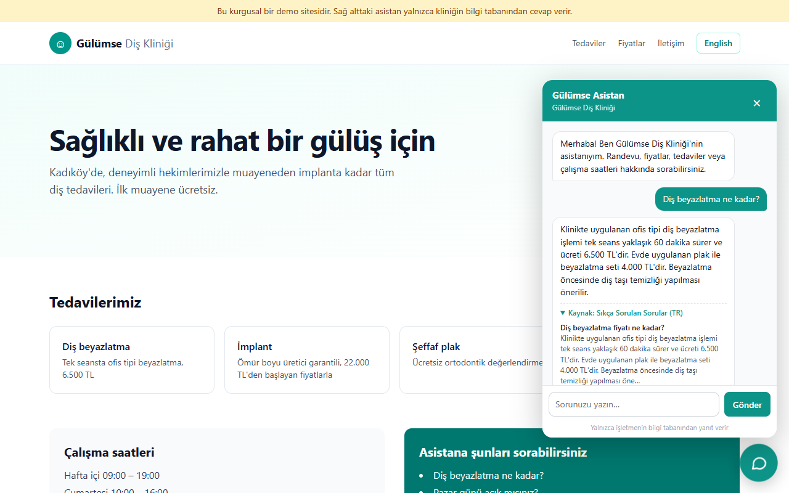
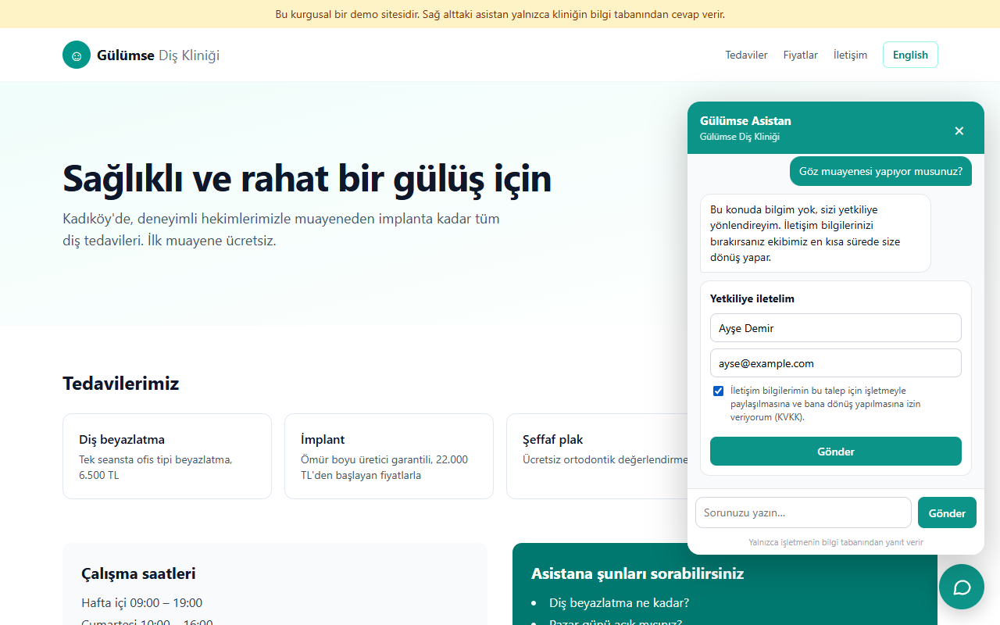
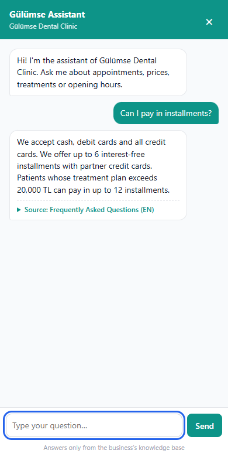
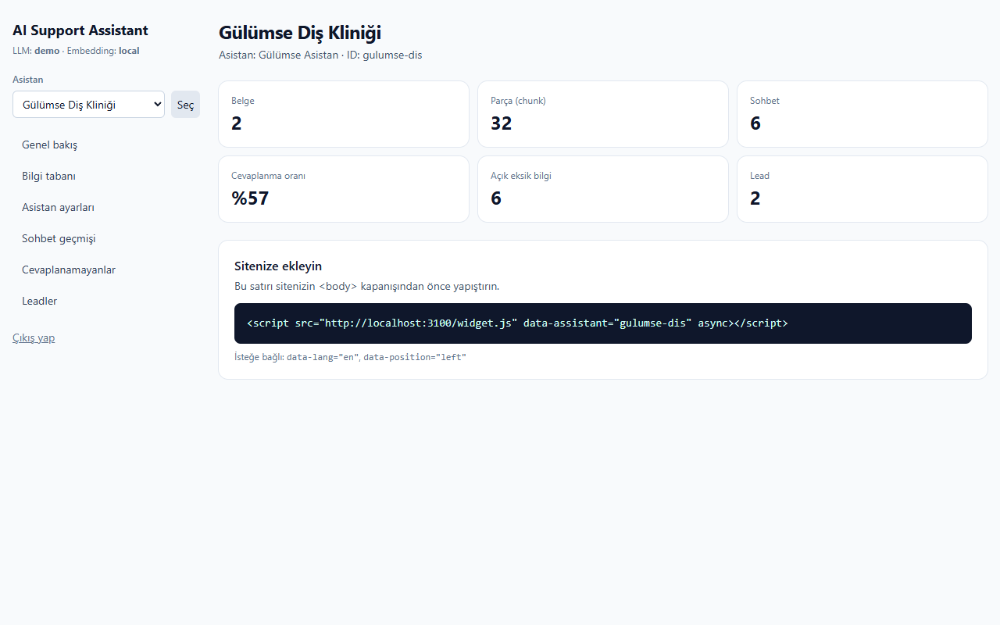
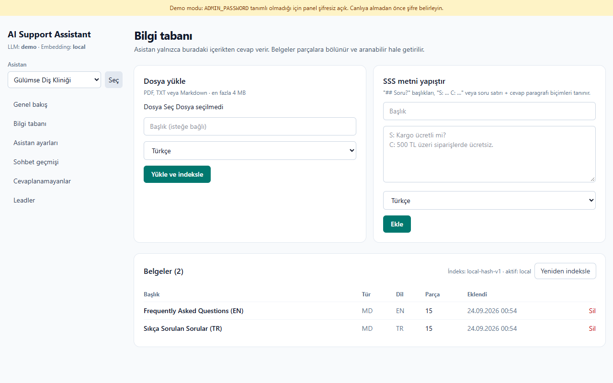
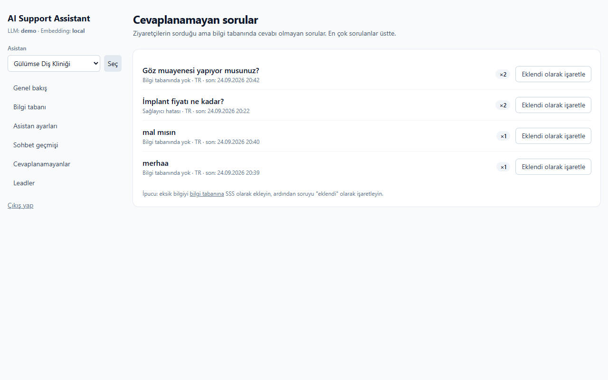
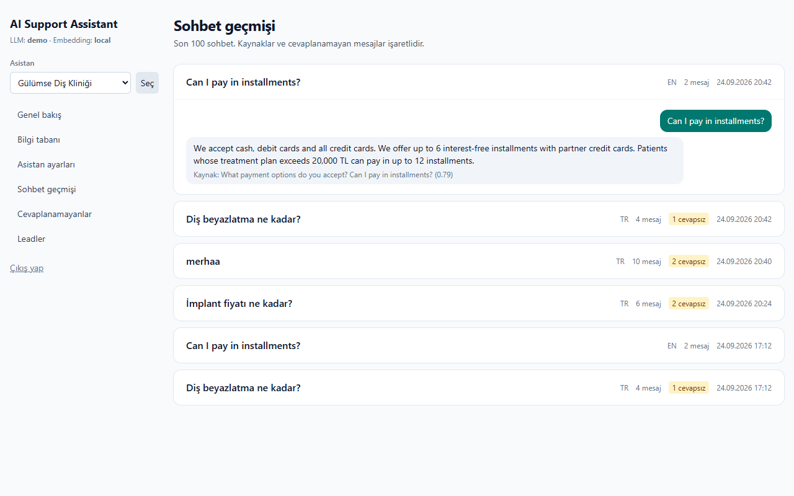
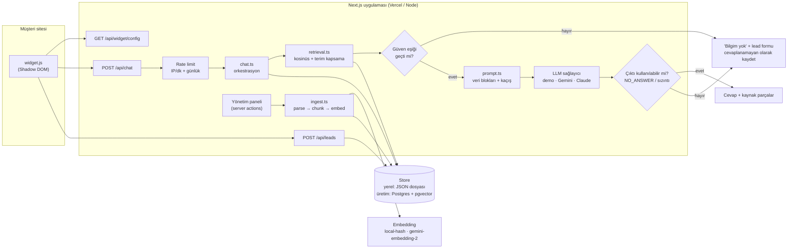

# AI Support Assistant

> **EN:** Upload your documents (PDF / TXT / Markdown / FAQ text), paste one `<script>` tag into your site, and get a
> support chat that answers **only from your knowledge base**, cites the source chunk for every answer, says
> "I don't know" instead of inventing, and turns unanswered questions into leads. Next.js + TypeScript, runs free in
> demo mode, Gemini or Claude in live mode.

İşletmenin dokümanlarından bilgi tabanı oluşturan, sitesine **tek satırlık script** ile eklenen ve yalnızca bilgi
tabanındaki içerikten, **kaynak göstererek** cevap veren destek asistanı. Bilgi yoksa uydurmaz: "bu konuda bilgim yok,
sizi yetkiliye yönlendireyim" der, ziyaretçinin onayıyla iletişim bilgisini alır ve işletmeye **lead** olarak kaydeder.



## Özellikler

- **Bilgi tabanı:** PDF, TXT, Markdown yükleme veya SSS metni yapıştırma → yapıya duyarlı parçalama (chunk) → embedding → hibrit arama.
- **Kaynaklı cevap:** Her cevabın altında hangi belgenin hangi bölümünden geldiği açılır kutuda gösterilir.
- **Uydurmama:** Güven eşiğinin altındaki sorular LLM'e hiç gönderilmez; model de bağlamda cevap yoksa `[[NO_ANSWER]]` döndürmek zorundadır.
- **Lead toplama:** Cevaplanamayan soruda widget içinde KVKK onaylı iletişim formu açılır.
- **Yönetim paneli:** Bilgi tabanı yükleme/silme/yeniden indeksleme, asistan adı/rengi/karşılama mesajı (TR/EN), izinli domainler, sohbet geçmişi, cevaplanamayan sorular (en çok sorulan üstte), leadler + CSV dışa aktarma, birden fazla asistan.
- **Widget:** Tek `<script>`, bağımlılıksız, **10,6 KB (gzip ~4,3 KB)**, Shadow DOM ile host sitenin stilini bozmaz, mobilde tam ekran, klavye erişilebilir, tüm metin `textContent` ile basılır (XSS yok).
- **Demo sitesi:** Kurgusal "Gülümse Diş Kliniği", TR ve EN bilgi tabanı hazır.
- **Maliyet kontrolü:** Demo modu sıfır maliyet. Canlı modda IP başına dakikalık limit, asistan başına günlük limit, soru uzunluğu, bağlam token bütçesi ve çıktı token sınırı.
- **Prompt injection savunması:** Bilgi tabanı metni talimat değil veri olarak ele alınır; ayraçlar kaçışlanır, şüpheli içerik işaretlenir, sızıntılı model çıktıları reddedilir. Hepsi testli.

## Ekran görüntüleri

| Bilgi yok → yönlendirme + lead formu | Mobil (EN) |
|---|---|
|  |  |

| Panel: genel bakış | Panel: bilgi tabanı |
|---|---|
|  |  |

| Panel: cevaplanamayan sorular | Panel: sohbet geçmişi |
|---|---|
|  |  |

Diğerleri: [landing](docs/screenshots/01-landing.png) · [leadler](docs/screenshots/10-admin-leads.png) · [ayarlar](docs/screenshots/11-admin-settings.png) · [mobil demo sayfası](docs/screenshots/04-mobile-demo-en.png)

## Mimari



**Sohbet akışı:**

1. Widget, script etiketindeki `data-assistant` ile ayarları çeker, ziyaretçinin sorusunu `/api/chat`'e yollar.
2. Rate limit (IP başına dakikalık, anahtar olarak IP'nin HMAC hash'i) ve asistan başına günlük limit kontrol edilir.
3. Soru, ziyaretçinin dilindeki parçalar içinde aranır. Skor = `0.5 × kosinüs + 0.5 × IDF ağırlıklı terim kapsama`.
4. **Eşik altındaysa LLM'e gidilmez** → "bilmiyorum" + lead formu, soru "cevaplanamayanlar"a yazılır. (Maliyet de oluşmaz.)
5. Eşik üstündeyse en iyi parçalar bağlam token bütçesi dolana kadar `<kb_document>` veri bloklarına sarılır, model çağrılır.
6. Model `[[NO_ANSWER]]` dönerse, hata verirse ya da çıktı sistem talimatlarını sızdırıyorsa yine yönlendirme yapılır.

## Hızlı başlangıç

Gereksinim: Node.js 20+ (22 ile test edildi).

```bash
npm install
```

```bash
npm run dev
```

- Landing: http://localhost:3000
- Demo site (TR): http://localhost:3000/demo · (EN): http://localhost:3000/demo?lang=en
- Yönetim paneli: http://localhost:3000/admin

İlk açılışta `data/db.json` yoksa demo asistan ve bilgi tabanı **otomatik** yüklenir. Sıfırlamak için:

```bash
npm run seed
```

Testler, tip kontrolü ve üretim derlemesi:

```bash
npm test
```

```bash
npm run typecheck
```

```bash
npm run build
```

README ekran görüntülerini yeniden üretmek (çalışan bir sunucuya karşı, sistemde kurulu Chrome ile; tarayıcı indirmez):

```bash
BASE_URL=http://localhost:3000 npm run screenshots
```

## Ortam değişkenleri

`.env.example` dosyasını `.env.local` olarak kopyalayın.

| Değişken | Varsayılan | Açıklama |
|---|---|---|
| `AI_PROVIDER` | `demo` | `demo`, `gemini` veya `claude`. İlgili API anahtarı yoksa **her durumda demo moduna düşer**. |
| `GEMINI_API_KEY` / `GEMINI_MODEL` | — / `gemini-3.5-flash` | Gemini ile üretim (ve isteğe bağlı embedding). |
| `GEMINI_EMBEDDING_MODEL` | `gemini-embedding-2` | `EMBEDDING_PROVIDER=gemini` iken kullanılan embedding modeli. |
| `ANTHROPIC_API_KEY` / `CLAUDE_MODEL` | — / `claude-haiku-4-5` | Claude ile üretim. |
| `EMBEDDING_PROVIDER` | `local` | `local` (ücretsiz, çevrimdışı) veya `gemini` (`GEMINI_EMBEDDING_MODEL`). Claude'un embedding API'si olmadığı için Claude modunda `local` kullanılır. Değiştirdikten sonra panelden **Yeniden indeksle** (seed ve otomatik kurulum her zaman `local` ile indeksler). |
| `RATE_LIMIT_PER_MINUTE` | `8` | IP + asistan başına dakikalık soru sayısı. |
| `DAILY_REQUEST_LIMIT` | `300` | Asistan başına günlük toplam soru. |
| `MAX_QUESTION_CHARS` | `500` | Soru uzunluğu sınırı. |
| `MAX_CONTEXT_TOKENS` | `1500` | Modele gönderilen bilgi tabanı bağlamının token bütçesi (yaklaşık, 4 karakter ≈ 1 token). |
| `MAX_OUTPUT_TOKENS` | `350` | Cevap başına çıktı token sınırı. |
| `ADMIN_PASSWORD` | — | Panel şifresi. Demo modunda boşsa panel açıktır (uyarı bandı gösterilir); **canlı modda boşsa panel kilitlenir**. |
| `SESSION_SECRET` | — | Cookie imzası ve IP hash'i için uzun rastgele bir değer. |
| `DATA_DIR` | `data` | Yerel veritabanı klasörü (Vercel'de otomatik `/tmp`). |

### Demo modu ve canlı mod

- **Demo modu** (varsayılan, anahtar yok): Arama gerçek çalışır; metin üretimi yerine en ilgili parçadan
  ekstraktif cevap ve önceden kaydedilmiş selamlama/teşekkür cevapları kullanılır. Hiçbir dış API çağrılmaz.
- **Canlı mod:** `AI_PROVIDER=gemini` + `GEMINI_API_KEY` ya da `AI_PROVIDER=claude` + `ANTHROPIC_API_KEY`.
  Çağrılar SDK'sız, doğrudan `fetch` ile yapılır (`src/lib/llm/`), sıcaklık 0.1, 20 sn zaman aşımı.

## Widget kurulumu

```html
<script src="https://SIZIN-ALAN-ADINIZ/widget.js" data-assistant="gulumse-dis" async></script>
```

| Özellik | Değerler |
|---|---|
| `data-assistant` | Panelde görünen asistan ID'si (zorunlu) |
| `data-lang` | `tr` / `en` (yoksa sayfanın `lang` özelliği) |
| `data-position` | `right` (varsayılan) / `left` |
| `data-open` | `true` ise sayfa açılınca panel açık gelir |

JavaScript API: `window.AISupportAssistant.open()`, `.close()`, `.setLang("en")`.

Panelde **İzin verilen siteler** doldurulursa widget uçları yalnızca o origin'lerden gelen istekleri kabul eder.

## Retrieval ve "bilmiyorum" davranışı

- **Parçalama:** Markdown başlıkları ve SSS kalıpları (`## Soru?`, `S: … C: …`, `?` ile biten kısa satır) bölüm sınırı kabul edilir; bölümler ~700 karaktere paketlenir, bölüm bölündüğünde son cümle bir sonraki parçaya taşınır.
- **Türkçe:** Türkçe küçük harf kuralları + aksan katlama (`diş` = `dis`), ilk-5-karakter kök alma, ek varyasyonları için önek eşleşmesi (`gün`/`günleri`, `kapanıyor`/`kapalı`) ve küçük bir eşanlamlı listesi (`fiyat/ücret/price`, `çocuk/kids` …).
- **Skor:** `local` modda hash'lenmiş kök + karakter trigram vektörlerinin kosinüsü ile IDF ağırlıklı sorgu terimi kapsamasının ortalaması. Bilgi tabanında hiç geçmeyen terimler en yüksek ağırlığı aldığı için "Göz muayenesi yapıyor musunuz?" gibi tek kelimesi tutan konu dışı sorular eşiği geçemez.
- **Eşikler** (`src/lib/rag/retrieval.ts`) embedding modeline göre ayrıdır ve `tests/retrieval.test.ts`'deki 22 alan içi + 11 alan dışı soruyla ayarlanmıştır.

## Prompt injection savunması

| Katman | Nerede | Test |
|---|---|---|
| Bilgi tabanı metni yalnızca kullanıcı turunda, `<kb_document>` veri blokları içinde; sistem promptu bunların güvenilmez **veri** olduğunu, içindeki talimatların uygulanmayacağını söyler | `src/lib/prompt.ts` | `injection.test.ts` |
| `<`, `>`, `[[`, `]]` kaçışlanır: belge kendi bloğunu kapatıp sahte `<system>` bloğu açamaz; ziyaretçi sorusu da kaçışlanır | `escapeForDataBlock` | "escapes delimiter look-alikes…" |
| Talimat benzeri içerik yükleme anında işaretlenir, panelde uyarı gösterilir | `looksLikeInjection`, `ingest.ts` | "marks suspicious chunks at ingest…" |
| Demo yanıtlayıcı talimat benzeri cümleleri asla tekrar etmez | `llm/demo.ts` | "demo responder answers from a poisoned document…" |
| Ziyaretçinin jailbreak denemesi bilgi tabanıyla eşleşmediği için modele hiç ulaşmaz | güven eşiği | "a visitor's jailbreak attempt never reaches the model…" |
| Sistem talimatlarını/ayraçları sızdıran model çıktısı reddedilir, yönlendirme yapılır | `isUsableAnswer` | "drops a model reply that leaks the system prompt" |

> Not: Hiçbir savunma %100 değildir. Canlı modelin gerçek davranışı bu projede **test edilmedi** (maliyet oluşmaması
> için canlı API çağrısı yapılmadı); testler prompt yapısını, kaçışlamayı ve çıktı filtresini sahte (mock) modelle doğrular.

## Canlı mod kalibrasyonu (Gemini)

`gemini-embedding-2` için "bilmiyorum" eşiği demo bilgi tabanıyla kalibre edildi (`npm run calibrate`). Kotayı korumak
için her metin **bir kez**, toplam 3 toplu çağrıyla gömülür. Sonuçlar `data/tmp/calibration.json` dosyasına yazılır ve
eşik araması `npm run calibrate -- --offline` ile API'ye dokunmadan tekrarlanabilir.

| Soru grubu | Örnek | Sonuç (eşik: `0.95 × kosinüs + 0.05 × kapsama ≥ 0.618`) |
|---|---|---|
| Alan içi (15) | "Pazar günü açık mısınız?" | 15/15 doğru bölüm, eşik üstü |
| Eşanlamlı (10) | "Ağzım kötü kokuyor" → *Halitozis*, "Diş teli" → *Ortodonti*, "bad breath" → *halitosis* | 10/10 doğru bölüm, eşik üstü (kelime örtüşmesi 0 olanlar dahil) |
| Konu dışı (8) | hava durumu, döviz, laptop, göz muayenesi, jailbreak | 8/8 eşik altı |
| Diş ama bilgi tabanında yok (4) | kanal tedavisi, yirmilik diş, veneer | **eşik üstü**: bunları modelin `[[NO_ANSWER]]` kuralı elemelidir |

Güvenlik payı her iki yönde yaklaşık 0,026; bilgi tabanı büyüdükçe kalibrasyonu yeniden çalıştırın. Yerel (`local`)
embedding eşanlamlıları yakalayamaz ("ağız kokusu" ↔ "halitozis"), bu yüzden canlı kullanımda Gemini embedding önerilir.

`npm run live-check` modeli uygulamanın kendi akışıyla uçtan uca dener (her soru bir kez, tekrar deneme yok, çağrılar
arası 15 sn). **Durum (24.09.2026):** ilk koşuda `gemini-3.5-flash` çağrılarının hepsi 503, zaman aşımı veya 429 ile
başarısız oldu; modelin bilgi tabanında olmayan diş sorularını reddettiği henüz **doğrulanmadı**. Sağlayıcı hata
verdiğinde ziyaretçiye artık "bilgim yok" yerine "şu anda yanıt veremiyorum" denir.

## Testler

`npm test` — 77 test (Vitest), hepsi demo modunda, ağ erişimi olmadan:

- `retrieval.test.ts` — 22 alan içi soru doğru bölümü buluyor, 11 alan dışı soru eşiği geçemiyor, dil tercihi, boş bilgi tabanı.
- `chat.test.ts` — kaynaklı cevap, EN cevap, "bilmiyorum" + cevaplanamayan kaydı, selamlama, sohbet geçmişi, uzunluk sınırı, model `NO_ANSWER`/hata durumları, bağlam bütçesi.
- `injection.test.ts` — tespit, kaçışlama, veri bloğu yapısı, zehirli belge, jailbreak, sızıntı filtresi.
- `parse.test.ts` — test içinde üretilen gerçek bir PDF'ten metin çıkarıp cevaplanabilir hale getirme.
- `units.test.ts` — chunker, Türkçe normalizasyon, embedding, rate limiter.

## Deploy ve üretim notları

Vercel'e ek ayar olmadan deploy edilebilir (`npm run build`). **Ancak** yerel JSON veritabanı Vercel'de `/tmp`'ye
yazılır ve **geçicidir** (her soğuk başlangıçta demo verisiyle yeniden oluşur); canlı demo için yeterli, gerçek müşteri
için değil. Üretim için önerilen değişiklikler:

| Bileşen | Yerel (bu repo) | Üretim önerisi |
|---|---|---|
| Veritabanı | `JsonStore` (tek dosya, sıfır kurulum) | **Postgres + pgvector** (ör. Neon, Vercel Marketplace üzerinden). `Store` arayüzü (`src/lib/store/types.ts`) tek değişim noktasıdır; vektör araması `ORDER BY embedding <=> $1` ile DB'ye taşınır. |
| Rate limit | Bellek içi sliding window (instance başına) | **Upstash Redis** (`@upstash/ratelimit`) — tüm instance'lar arasında paylaşılır. |
| Embedding | `local-hash-v1` | `gemini-embedding-2` (anlamsal; eşanlamlılar ve farklı ifadeler için belirgin şekilde daha iyi) |
| Admin auth | Tek şifre + HMAC cookie | Çok kullanıcılı SaaS için Clerk / Auth.js + işletme başına yetki |
| Dosya boyutu | Server action 5 MB, belge 4 MB | Büyük PDF'ler için Blob'a yükleme + arka plan işleme |

`x-forwarded-for` başlığı Vercel gibi bir proxy arkasında güvenilirdir; doğrudan internete açık bir Node sunucusunda
sahte değer gönderilebileceği için rate limit anahtarını güvenilir proxy başlığından alın.

## Gizlilik notu

- **Toplanan veriler:** ziyaretçinin soruları ve asistan cevapları (sohbet geçmişi), cevaplanamayan sorular ve yalnızca
  ziyaretçi **açık onay kutusunu işaretlediğinde** ad + e-posta/telefon (lead). Lead ucu onay olmadan kayıt yapmaz.
- **IP adresleri saklanmaz.** Rate limit için yalnızca `SESSION_SECRET` ile anahtarlanmış HMAC hash'i bellekte tutulur.
- **Çerez yok:** Widget çerez kullanmaz; sohbet kimliği tarayıcı sekmesi kapanınca silinen `sessionStorage`'da tutulur.
- **Üçüncü taraflar:** Canlı modda soru ve ilgili bilgi tabanı parçaları seçilen LLM sağlayıcısına (Google Gemini veya
  Anthropic) gönderilir. Lead bilgileri **hiçbir sağlayıcıya gönderilmez.** Demo modunda hiçbir veri dışarı çıkmaz.
- **Saklama:** Yerel depoda son 2000 sohbet tutulur; leadler panelden silinebilir ve CSV olarak dışa aktarılabilir
  (CSV formül enjeksiyonuna karşı hücreler etkisizleştirilir).
- **İşletmenin sorumluluğu:** KVKK/GDPR kapsamında aydınlatma metnini yayımlamak, saklama süresini belirlemek ve
  sağlayıcılarla veri işleme sözleşmelerini yapmak widget'ı kullanan işletmeye aittir. Hassas (ör. sağlık) bilgilerin
  bilgi tabanına konmaması ve ziyaretçilerin sohbet kutusuna kişisel sağlık bilgisi yazmaması için uyarı eklenmesi önerilir.

## Proje yapısı

```
data/seed/            Demo bilgi tabanı (TR/EN markdown)
docs/screenshots/     README görselleri
scripts/              seed.ts, screenshots.ts
src/app/              Landing, /demo, /admin (panel + server actions), /api (chat, leads, widget/config)
src/lib/rag/          text (TR normalizasyon), chunker, embeddings, retrieval, parse, ingest
src/lib/llm/          demo, gemini, claude
src/lib/prompt.ts     Sistem promptu + injection savunması
src/lib/chat.ts       Sohbet orkestrasyonu
src/lib/store/        Store arayüzü + JSON uygulaması
widget/widget.ts      Gömülebilir widget (esbuild → public/widget.js)
tests/                Vitest testleri
```

## Lisans

Portföy projesi. Demo işletme ("Gülümse Diş Kliniği"), adresi ve fiyatları tamamen kurgusaldır.
